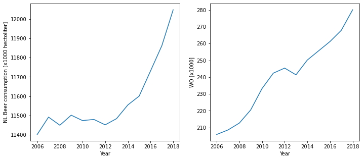

<h1> CS Assignment </h1>

###### Levien van Krieken 	13-09-2020	13477307

* M.C.C. Van Dyke et al., 2019: 

  Fantastic yeasts and where to find them: the hidden diversity of dimorphic fungal pathogens

* J.T. Harvey, Applied Ergonomics, 2002: 

  An analysis of the forces required to drag sheep over various surfaces

* D.W. Ziegler et al., 2005: 

  Correlation of continuous cardiac output measured by a pulmonary artery catheter versus impedance cardiography in ventilated patients

  

  ### Correlation?

  Seems like more students amounts to more beers?

  
